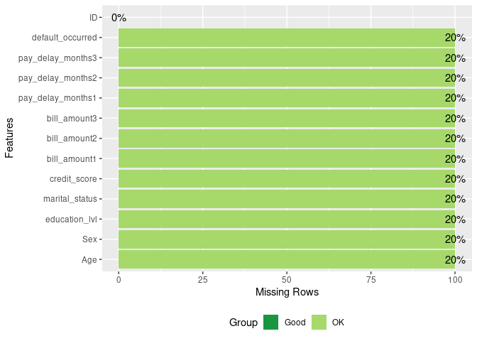
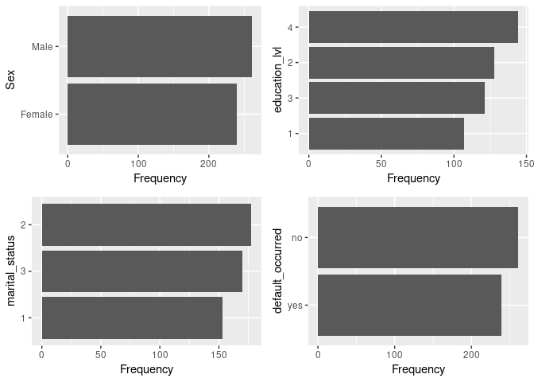
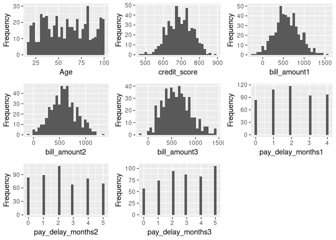

Machine Learning Pipelines with Caret
================

This notebook will provide a detailed example of how what a traditional machine learning pipeline looks like in R using the `caret` package for hyperparameter optimization.

For practice, we will fit a classifier to predict the probability of loan default for a bank's customers. We will use the `wakefield` package to generate this dataset that we will fit multiple classifiers to and evaluate which model is the best.

1. Create Dataset
-----------------

First we need to import the packages that we will use throughout this notebook.

``` r
library(wakefield)
library(dplyr)
library(DataExplorer)
library(mice)
library(caret)
library(gencve)
library(fastAdaboost)
library(ggplot2)
```

We will generate a dataset and set roughly 20% of the data to missing. This is done to simulate a real life dataset, as they are rarely ever complete. Datasets with missing values are a reality that every data scientist must deal with.

As unfortunate as that may be, it gives us the opportunity to use some sophisticated data imputation algorithms, like we will use here.

``` r
raw_data <- r_data_frame(n = 500,
                         id,
                         age(x = 18:100),
                         sex,
                         education_lvl = sample(1:4, n, replace = TRUE),
                         marital_status = sample(1:3, n, replace = TRUE),
                         credit_score = rnorm(mean = 687, sd = 69),
                         bill_amount1 = rnorm(mean = 612, sd = 300),
                         bill_amount2 = rnorm(mean = 587, sd = 256),
                         bill_amount3 = rnorm(mean = 621, sd = 312),
                         pay_delay_months1 = sample(0:4, n, replace = TRUE),
                         pay_delay_months2 = sample(0:5, n, replace = TRUE),
                         pay_delay_months3 = sample(0:5, n, replace = TRUE),
                         default_occurred = dummy
                         #default_occurred = sample(c('no', 'yes'), n, replace = TRUE)
) %>% r_na(prob = 0.2)
```

2. Data Cleaning
----------------

We should check our data for missing values.

``` r
plot_missing(raw_data)
```



Just as we had asked, 20% of each feature is missing from our data. This then justifies the need for data imputation as a cleaning step within our pipeline.

Imputation is valid here because we know that our data is missing completely at random (MCAR). In other words, the mechanism for missingness in our data has nothing to do with any bias within our data set. The missigness of the data is independent of the data.

### A. Choosing an Imputation Algorithm

The MICE algorithm is probably the most robust method available to impute missing data. MICE is an acronymn for "Multiple Imputation using Chained Equations". This an adaptive approach to data imputation that will choose different imputation algorithms depending on the data type of the feature being imputed.

Continuous features will be imputed using the *predictive mean matching* algorithm. Binary features will be imputated using a *logistic regression*. And categorical variables will be imputed using a *Multivariate logistic regression*.

All of the imputation agorithms utilized by MICE are based on Bayesian statistical theory, which should put concerned statisticians' minds at ease.

### B. Performing our Imputation

The `MICE` package can help us clean our data.

``` r
# Remove the ID column before imputing
raw_data <- select(raw_data, -c(ID))

# Use MICE w/ five imputation passes
guess_missing <- mice(raw_data, printFlag = FALSE)

# Select the final (fifth) imputation pass as our imputed dataset
imputed_data <- complete(guess_missing, 5)
```

A quick check to ensure that MICE cleaned our missing values by imputing them:

``` r
plot_missing(imputed_data)
```


Success never felt so good.

### 3. Exploratory Data Analysis

Let's perform some quick exploratory data analysis to get an idea of what this dataset looks like.

``` r
# Set categorical variables as factors within our dataframe
cat_var_vector <- c('education_lvl', 'default_occurred', 'marital_status')
imputed_data <- imputed_data %>% mutate_at(cat_var_vector, funs(factor(.)))
```

    ## Warning: funs() is soft deprecated as of dplyr 0.8.0
    ## please use list() instead
    ## 
    ## # Before:
    ## funs(name = f(.)
    ## 
    ## # After: 
    ## list(name = ~f(.))
    ## This warning is displayed once per session.

``` r
# Decode depdendent variable
imputed_data <- imputed_data %>% 
  mutate(default_occurred = factor(
    ifelse(
      default_occurred == 0, 'no', 'yes')
    ))

# Visualize all categorical/binary features
plot_bar(imputed_data)
```



Our dependent variable `default_occurred` appears to be balanced between the two values. Therefore, we won't need to oversample this feature as a pre-processing step.

``` r
# Visualize all continuous variables
plot_histogram(imputed_data)
```



Most of these curves appear to be either normal or logistic distributions.

### 4. Pre-processing

We should split our imputed dataset into train and test components before fitting our models.

``` r
# Decode dependent variable factor levels to either "yes" or "no"
levels(imputed_data$default_occurred) <- c('no', 'yes')

idx <- createDataPartition(imputed_data$default_occurred, 
                           p = 0.8, 
                           list = FALSE, 
                           times = 1)

training_data <- imputed_data[idx, ]
test_data <- imputed_data[-idx, ]
```

### 4. Model Training

We should elect to train our model using minimized logarithmic loss as our optimization algorithm. This is because log loss will punish models for predicting wrong answers with high confidence, which is exactly what our use case calls for.

#### A. Logistic Regression

Let's use `caret` to fit the fan-favorite logistic regression to our dataset. We will use 10-fold cross-validation to help mitigate overfitting.

``` r
# Setup training parameters using Log Loss
logistic_control <- trainControl(method = 'cv',
                                 number = 10,
                                 classProbs = TRUE,
                                 summaryFunction = mnLogLoss,
                                 allowParallel = TRUE)

# Fit the classifier to the data
logistic_fit <- train(default_occurred ~ .,
                      data=training_data,
                      method='glm',
                      family='binomial',
                      trControl=logistic_control,
                      metric = "logLoss")
```

Our logistic regression model is now trained and we can test it's ability to predict the correct dependent variable value.

``` r
logistic_predict <- predict(logistic_fit, newdata=test_data)
logistic_logloss <- logloss(test_data$default_occurred, logistic_predict)

print(logistic_logloss)
```

    ## [1] 67.75142

The logloss number can be used to benchmark the efficacy of one model against another, similar to how the mean squared error value is used to pick the best model.

Next, the confusion matrix can be generated to check the accuracy of the model.

``` r
confusionMatrix(table(logistic_predict, test_data$default_occurred))
```

    ## Confusion Matrix and Statistics
    ## 
    ##                 
    ## logistic_predict no yes
    ##              no  29  27
    ##              yes 23  20
    ##                                           
    ##                Accuracy : 0.4949          
    ##                  95% CI : (0.3929, 0.5973)
    ##     No Information Rate : 0.5253          
    ##     P-Value [Acc > NIR] : 0.7596          
    ##                                           
    ##                   Kappa : -0.0168         
    ##  Mcnemar's Test P-Value : 0.6714          
    ##                                           
    ##             Sensitivity : 0.5577          
    ##             Specificity : 0.4255          
    ##          Pos Pred Value : 0.5179          
    ##          Neg Pred Value : 0.4651          
    ##              Prevalence : 0.5253          
    ##          Detection Rate : 0.2929          
    ##    Detection Prevalence : 0.5657          
    ##       Balanced Accuracy : 0.4916          
    ##                                           
    ##        'Positive' Class : no              
    ## 

In this case the accuracy of our model performs no better than flipping a coin. This is what is scientifically known as "garbage accuracy."

Q: Why is our accuracy so low?

A: Remember that we generated this dataset at the beginning of this exercise. The data we created does not have the underlying statistical phenomena that is represented in real life data. In effect, we are evaluating how well our models fit to randomness.

Q: Why bother doing this then?

A: This notebook is a *how to* example of what a typical machine learning pipeline looks like. It is not meant to uncover new ground truths within a dataset. The models trained here will not be deployed because they are being trained to fake data. This notebook is just a portrait of what is possible and how it can be done efficiently.

#### B. Adaptive Boosting Decision Trees

Let's go from 0 to 100 real quick by training a boosted ensemble method. We will train a random forest algorithm that will use the principle of boosting to address any leftover error from previous model iterations as the target to address for subsequent models.

The hope is that this boosting process should produce a model with higher accuracy. In this case we will definitely be overfitting to statistical noise.

We will perform a grid search to optimize our hyperparameter selection.

``` r
adaboost_control <- trainControl(method = 'cv',
                                       number = 10,
                                       classProbs = TRUE,
                                       summaryFunction = mnLogLoss,
                                       allowParallel = TRUE)

# Define the no. of classifiers for each tree hyperparameter grid
adaboost_grid <- expand.grid(nIter = seq(2, 11, 4), method = 'adaboost')

adaboost_fit <- train(default_occurred ~ .,
                            data = training_data,
                            method='adaboost',
                            trControl = adaboost_control,
                            tuneGrid = adaboost_grid,
                            metric = "logLoss")
```

Let's check to see which hyperparameters produced the most accurate boosted random forest model.

``` r
adaboost_fit$bestTune
```

    ##   nIter   method
    ## 2     6 adaboost

``` r
adaboost_predict <- predict(adaboost_fit, newdata=test_data)
rf_logloss <-logloss(test_data$default_occurred, adaboost_predict)

print(rf_logloss)
```

    ## [1] 67.94435

The performance of the ensemble method was not as strong as we would have hoped for. The additional computation cost of this model doesn't seem to be worth the margin improvement in decreased log loss error.

#### C. Naive Bayes

The third and final algorithm we'll train will be a naive Bayes classifier. The canonical example of where this algorithm is used is for email spam classification, where naive Bayes are able to efficiently classify spam emails based on their text contents.

``` r
nb_control <- trainControl(method = 'cv',
                           number = 10,
                           classProbs = TRUE,
                           summaryFunction = mnLogLoss,
                           allowParallel = TRUE)

nb_grid <- expand.grid(laplace = c(0, 1),
                       usekernel = c(TRUE, FALSE),
                       adjust = seq(0, 5))

bayes_fit <- train(default_occurred ~.,
                data = training_data,
                method = 'naive_bayes',
                trControl = nb_control,
                tuneGrid = nb_grid,
                metric = 'logLoss')
```

Let's look at how accurately naive Bayes can classify our default occurances.

``` r
bayes_predict <- predict(bayes_fit, newdata=test_data)
bayes_logloss <-logloss(test_data$default_occurred, bayes_predict)

print(bayes_logloss)
```

    ## [1] 66.61769

The naive Bayes algorithm was able to edge out the other models. It is the most accurate classifier out of the bunch so we will elect to use it to predict the probabilities of a bank customer default on their loan.

### 5. Report Probabilities of Loan Default

For each customer within our test dataset we will use our most accurate model to predict the probabilities that they will default on their loan.

``` r
# Predict the probability that default = yes for each observation
probabilities_vector <- predict(bayes_fit, 
                             test_data,
                             type = 'prob')

# Show an example of the first 10 probabilities
print(probabilities_vector$yes[1:10])
```

    ##  [1] 0.4515728 0.2711351 0.6026572 0.3641748 0.4198962 0.4210829 0.4388732
    ##  [8] 0.4312135 0.4031854 0.4645055

This is an example of the task that you would wish your deployed model to continually report to some line of business you're supporting internally. The model would be trained continually or on a batch basis and would report the probabilities of customers defaulting on their loans. These predictions could then be used to assess the risk involved with loans to make better business decisions.

### 6. Conclusion

This is an example of a typical machine learning pipeline for training a classification model. Although this process was conducted on a toy dataset, the functions and steps taken here are indicative of the type of workflow you would use when working with real life data.
