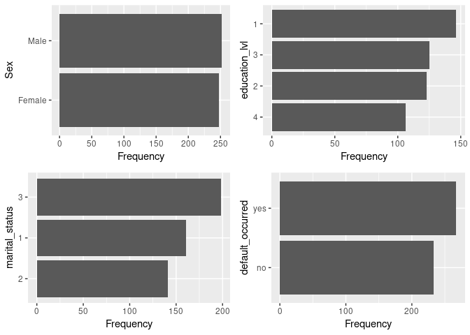
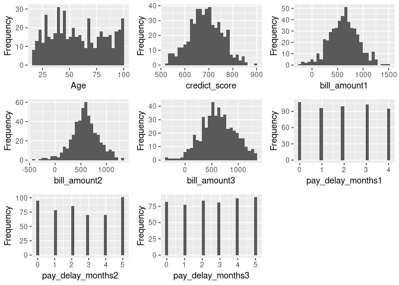

Machine Learning Pipelines with Caret
================

This notebook will provide a detailed example of how what a traditional
machine learning pipeline looks like in R using the `caret` package for
hyperparameter optimization.

For practice, we will fit a classifier to predict the probability of
loan default for a bank’s customers. We will use the `wakefield` package
to generate this dataset that we will fit multiple classifiers to and
evaluate which model is the best.

## 1\. Create Dataset

First we need to import the packages that we will use throughout this
notebook.

``` r
library(wakefield)
library(dplyr)
library(DataExplorer)
library(mice)
library(caret)
```

We will generate a dataset and set roughly 20% of the data to missing.
This is done to simulate a real life dataset, as they are rarely
complete.

As unfortunate at that may be, it gives us the opportunity to use some
sophisticated data imputation algorithms, like we will use here.

``` r
raw_data <- r_data_frame(n = 500,
                         age(x = 18:100),
                         sex,
                         education_lvl = sample(1:4, n, replace = TRUE),
                         marital_status = sample(1:3, n, replace = TRUE),
                         credict_score = rnorm(mean = 687, sd = 69),
                         bill_amount1 = rnorm(mean = 612, sd = 300),
                         bill_amount2 = rnorm(mean = 587, sd = 256),
                         bill_amount3 = rnorm(mean = 621, sd = 312),
                         pay_delay_months1 = sample(0:4, n, replace = TRUE),
                         pay_delay_months2 = sample(0:5, n, replace = TRUE),
                         pay_delay_months3 = sample(0:5, n, replace = TRUE),
                         default_occured = dummy
) %>% r_na(prob = 0.2)
```

## 2\. Data Cleaning

We should check our data for missing
values.

``` r
plot_missing(raw_data)
```

<!-- -->

Just as we had asked, 20% of each feature is missing from our data. This
then justifies the need for data imputation as a cleaning step within
our pipeline.

Imputation is valid here because we know that our data is missing
completely at random (MCAR). In other words, the mechanism for
missingness in our data has nothing to do with any bias within our data
set. The missigness of the data is independent of the data.

### A. Choosing an Imputation Algorithm

The MICE algorithm is probably the most robust method available to
impute missing data. MICE is an acronymn for “Multiple Imputation using
Chained Equations”. This an adaptive approach to data imputation that
will choose different imputation algorithms depending on the data type
of the feature being imputed.

Continuous features will be imputed using the *predictive mean matching*
algorithm. Binary features will be imputated using a *logistic
regression*. And categorical variables will be imputed using a
*Multivariate logistic regression*.

All of the imputation agorithms utilized by MICE are based on Bayesian
statistical theory, which should put concerned statisticians’ minds at
ease.

### B. Performing our Imputation

The `MICE` package can help us clean our data.

``` r
# Use MICE w/ five imputation passes
guess_missing <- mice(raw_data, printFlag = FALSE)

# Select the final (fifth) imputation pass as our imputed dataset
imputed_data <- complete(guess_missing, 5)
```

A quick check to ensure that MICE cleaned our missing values by imputing
them:

``` r
plot_missing(imputed_data)
```

<!-- -->

Success never felt so good.

### 3\. Exploratory Data Analysis

Let’s perform some quick exploratory data analysis to get an idea of
what this dataset looks like.

``` r
# Set categorical variables as factors within our dataframe
imputed_data$education_lvl <- as.factor(imputed_data$education_lvl)
imputed_data$default_occured <- as.factor(imputed_data$default_occured)
imputed_data$marital_status <- as.factor(imputed_data$marital_status)

# Visualize all categorical/binary features
plot_bar(imputed_data)
```

<!-- -->

Our dependent variable `default_occured` appears to be balanced between
the two values. Therefore, we won’t need to oversample this feature as a
pre-processing step.

``` r
# Visualize all continuous variables
plot_histogram(imputed_data)
```

<!-- -->

Most of these curves appear to be either normal or logistic
distributions.

### 4\. Pre-processing

We should split our imputed dataset into train and test components
before fitting our models.

``` r
idx <- createDataPartition(imputed_data$default_occured, 
                           p = 0.8, 
                           list = FALSE, 
                           times = 1)

training_data <- imputed_data[idx, ]
test_data <- imputed_data[-idx, ]
```

### 4\. Model Training

Let’s use `caret` to fit the fan-favorite logistic regression to our
dataset.
